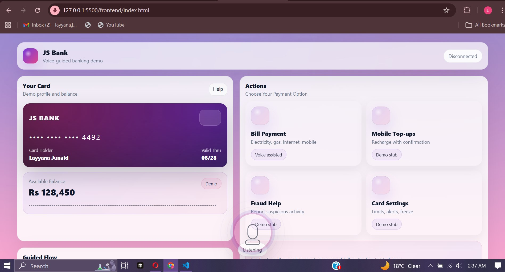

# *Voice Assistance Agent*

### *AI-Powered Voice-Guided Banking Demo*

**Team Name:** Nexsusu
**Participants:**

* Layyana Junaid
* Maryam Mustafa
* Khadija Atiq
* Wafa Zehra

---

## Project Overview

Voice Assistance Agent is an AI-powered, voice-guided banking interface designed to simplify digital banking interactions through natural speech and real-time UI guidance.

The system allows users to complete tasks like bill payments using voice commands while the assistant guides them step-by-step by highlighting exactly what to click on the screen.

Instead of static help menus or text-heavy FAQs, this solution provides:

* Real-time voice interaction
* Context-aware step-by-step guidance
* Smart UI highlighting
* Interactive modal navigation
* Mock payment processing with balance deduction

This project demonstrates how voice agents can enhance user experience in digital banking platforms.

---
## Video Demonstration
##### due to the issue of presence of voice in the screen recorded video, I am attaching a manually recorded video, apologies for inconvinience!

https://github.com/user-attachments/assets/b3b7beac-b75b-4dbe-8642-8afc87e10ac9


Link your demo video here:

```

https://github.com/user-attachments/assets/b3b7beac-b75b-4dbe-8642-8afc87e10ac9


```

## Problem Statement

Digital banking applications often suffer from:

* Complex navigation paths
* Too many steps for simple tasks
* Low user confidence when making payments
* High support dependency
* Poor accessibility for non-technical users

Users frequently abandon tasks when unsure about what to click next.

There is a need for an intelligent, real-time, conversational guidance system that assists users directly inside the application interface.

---

## Proposed Solution

We developed a Voice-Guided Banking Assistant that:

1. Allows users to speak naturally.
2. Uses AI to understand the user's intent.
3. Guides users step-by-step by:

   * Highlighting required UI elements
   * Opening modals
   * Waiting for user clicks
4. Provides human-like voice responses.
5. Simulates payment confirmation with balance updates.

The assistant ensures users never feel lost while navigating the interface.

---

## Key Features

* Voice Input Toggle (Start / Stop)
* Natural Language Understanding (Intent + Slots)
* Step-by-step UI highlighting
* Real-time WebSocket communication
* Bill Payment flow with:

  * Biller selection
  * Amount entry
  * Confirmation screen
  * Balance deduction
* Natural voice feedback (Text-to-Speech)
* Clean banking-style UI
* No transcript clutter

---
## Technology Stack

### Frontend

* HTML
* CSS
* JavaScript
* Web Speech API (SpeechRecognition)
* Speech Synthesis API
* WebSocket Client

### Backend

* FastAPI
* WebSocket API
* LangChain
* Groq LLM
* Python

---

## How It Works

1. User presses the microphone.
2. Speech is converted to text via Web Speech API.
3. Text is sent to backend through WebSocket.
4. Flow Engine determines the required next step.
5. LangChain:

   * Extracts intent (NLU)
   * Generates natural coaching response
6. Backend sends UI actions to frontend.
7. Frontend:

   * Highlights UI elements
   * Opens modals
   * Waits for click
8. On confirmation, mock balance is deducted.

---

## Demo Flow: Bill Payment

* User says: “Pay electricity bill 5000”
* Assistant highlights Bill Payment tile
* User clicks tile
* Assistant opens modal
* User selects biller and enters amount
* Assistant highlights Continue
* User confirms payment
* Balance updates
* Voice confirms success

---

## Project Structure

```
Voice_Assistance_Agent/
│
├── backend/
│   ├── app/
│   │   ├── ws.py
│   │   ├── services/
│   │   │   ├── flow_engine.py
│   │   │   ├── langchain_agent.py
│   │   └── schemas.py
│   └── main.py
│
├── frontend/
│   ├── index.html
│   ├── style.css
│   └── app.js
│
├── README.md
└── .gitignore
```

---

## Installation & Running

### 1. Clone the repository

```bash
git clone https://github.com/layyana-junaid/Voice_Assistance_Agent.git
cd Voice_Assistance_Agent
```

### 2. Backend Setup

```bash
cd backend
python -m venv venv
venv\Scripts\activate
pip install -r requirements.txt
```

Set environment variables:

```bash
set GROQ_API_KEY=your_api_key
set GROQ_MODEL=llama-3.1-70b-versatile
```

Run server:

```bash
uvicorn main:app --reload --port 8000
```

### 3. Frontend

Open `frontend/index.html` in browser (Chrome recommended).

---

## Working Workflow:

### Dashboard View



### Highlighted Indications


### Bill Payment Flow


### Confirmation Screen


## Future Improvements

* Real banking API integration
* Authentication layer
* Persistent session storage
* Multilingual support (English / Urdu)
* Advanced emotional tone adaptation
* Production-grade security controls

---

## Conclusion

Voice Assistance Agent demonstrates how AI-powered conversational systems can significantly improve usability in digital banking environments.

By combining natural language understanding, real-time UI control, and voice feedback, this project showcases the future direction of interactive financial applications.


